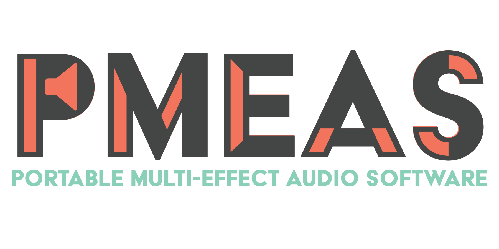

## Description
The Portable Multi-Effect Audio Software system is a sound modulator that takes in an input from an instrument and applies effects to the audio stream before sending it to a speaker system. It utilizes the [Pyo](http://ajaxsoundstudio.com/software/pyo/ "Pyo") library to apply the effects.

This is one component of several components that comprise the PMEAS system. Find the other components [here](https://github.com/pmeas "PMEAS group page").

### Supported Effects
The system currently modulates audio with the following seven effects:
* [ Distortion](http://ajaxsoundstudio.com/pyodoc/api/classes/effects.html#disto)
* [ Delay ]( http://ajaxsoundstudio.com/pyodoc/api/classes/effects.html#delay )
* [ Chorus ](http://ajaxsoundstudio.com/pyodoc/api/classes/effects.html#chorus)
* [ Reverb ]( http://ajaxsoundstudio.com/pyodoc/api/classes/effects.html#strev )
* [ Flanger ]( http://ajaxsoundstudio.com/pyodoc/tutorials/pyoobject2.html )
* [ Harmonizer]( http://ajaxsoundstudio.com/pyodoc/api/classes/effects.html#harmonizer )
* [ Frequency Shift ]( http://ajaxsoundstudio.com/pyodoc/api/classes/effects.html#freqshift )

The system also implements a multi-track looper through the help of a optional GPIO button.

## Supported Operating Systems
This backend application is designed to be run on an embedded device, but can also be ran on the same device as the [frontend](https://github.com/pmeas/pmeas-frontend).

Through the help of Python, we are able to support all Linux based distrbutions, as well as all operating systems that support the JACK audio server, even though we only focused exclusively on supporting the Raspberry Pi.

## Installation

### Necessary Dependencies
* [Python 2.7.13]( https://www.python.org/downloads/ )
* [Pyo 0.7.3]( http://ajaxsoundstudio.com/software/pyo/ )
* [JACK Audio]( http://www.jackaudio.org/ )

### Optional Dependencies
* [Raspberry Pi with Wifi ]( https://www.raspberrypi.org/products/raspberry-pi-3-model-b/ )
  * [Raspbian Jesse](https://www.raspberrypi.org/downloads/raspbian/)
  * Any GPIO Button, *( Used for multi-track looper )*

### Instructions
1. Clone this repo to a local directory.
2. Run the install script `sudo ./install.sh` to download all necessary dependencies and register the service with systemd.
3. Start the PMEAS service by calling `sudo systemctl start pmeas.service`.

*(The service will also start independently on boot of the system. )*

## Common Issues
* [Application crash](https://github.com/pmeas/pmeas-backend/issues/64)