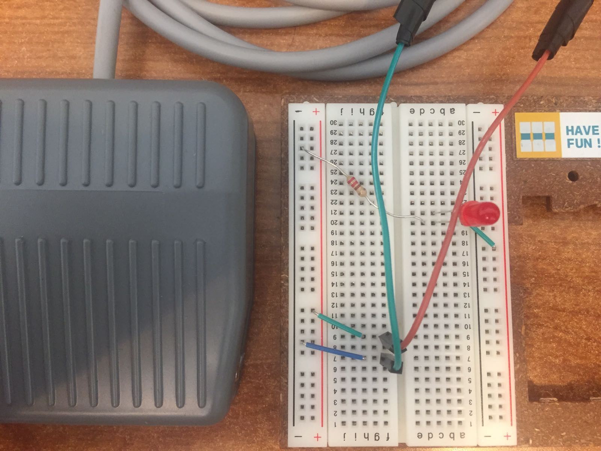
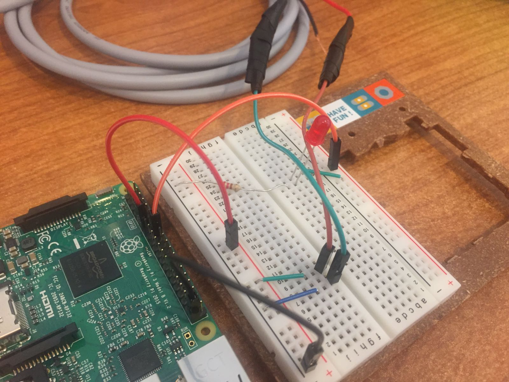

# GPIO Installation Instructions

The PMEAS system supports loop machine functionality to allow the musician to record an audio stream and play it in a live loop. Multiple loops can be stacked on top of one another for more complex compositions. To use the functionality, however, physical components must be added to the system to make the experience as close to a physical pedal as possible. Naturally, the use of GPIO is a necessity for the functionality of the loop machine. These instructions show you how to hook up the physical components to enable loopback.

### Hardware Required
* Hardware device with GPIO pins (in this example, a Raspberry Pi will be the target device)
* Female to male pins
* Breadboard
* Stompbox
* LED light

### Installation Procedures
> Before connecting any components to the device, ensure it is powered off to avoid shorting the device or any of the components.

1. Begin by assembling the breadboard in a similar fashion as the image below

> Take note here that for the stompbox seen in the photo, the red-colored connector pin will be connected to power, and the green-colored connector pin will connect to ground. 

> The LED light we use here requires the use of a 220-ohm resistor. Make sure any LED you place receives the proper amount of voltage to avoid shorting the board.

2. Connect the breadboard with the Pi by following the image below:

> Be careful to power the stompbox and the LED light with the proper pins on the Pi, else the circuit will never be activated. In this project, **Raspberry Pi 3B GPIO pin number 17 is used to activate the stompbox, and GPIO pin number 23 is used to activate the LED light.** [Click here](https://developer.microsoft.com/en-us/windows/iot/docs/pinmappingsrpi "Raspberry Pi GPIO Pins") to see where you can locate these pins on the Pi board. Ground can be connected to any of the pins labelled with "GND" as seen in the link. For our purposes, we use board pin 39 (i.e the lowest pin on the left side) for ease of identification.

3. Power on the Pi and use the stompbox to confirm it works as intended.
